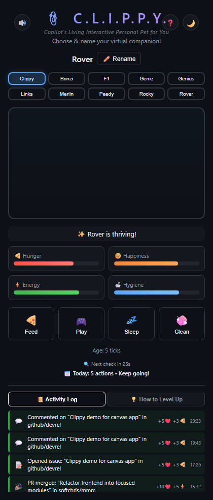

# 📎 C.L.I.P.P.Y.

**Copilot's Living Interactive Personal Pet for You**

A Tamagotchi-style virtual pet canvas extension for the [GitHub Copilot](https://github.com/features/copilot) desktop app. Choose from 10 classic MS Office assistants, keep them happy, and watch them react to your real coding activity!



## ✨ Features

- **10 Classic Characters** — Clippy, Bonzi, F1, Genie, Genius, Links, Merlin, Peedy, Rocky, Rover
- **Tamagotchi Mechanics** — Feed, play, sleep, and clean your pet to keep stats up
- **No Death** — Clippy never dies! Stats floor at minimum values (but very low stats = sad Clippy)
- **Auto-Discovers Repos** — Automatically watches your owned + contributed repos (no config needed!)
- **Name Your Pet** — Give your companion a custom nickname
- **Thought Bubbles** — Clippy tells you what they need based on their lowest stat
- **Idle Animations** — Characters bounce, wander, sleep, and react based on mood
- **🌙/☀️ Theme Toggle** — Dark and light mode support
- **🔇 Mute Button** — Silence clippy.js sounds with one click (persists across reloads)
- **💤 Sleep Recovery** — Friendly overlay with "Wake Up" button if the extension restarts
- **❓ About Modal** — Explains all rewards and mechanics in-app

## 🚀 Session Awareness

Clippy reacts to your real GitHub activity in real-time!

| Action | Happiness | Bonus |
|--------|-----------|-------|
| 🌟 Close an issue | +10 | +5 energy |
| ✅ Build succeeds | +10 | +5 energy |
| ✨ Tests pass | +10 | +5 energy |
| 🎉 PR merged | +10 | +5 energy |
| 📝 Create an issue | +5 | +3 hunger |
| 📨 Open a PR | +5 | +3 hunger |
| 💬 Comment on issue | +5 | +3 hunger |
| ✏️ Edit an issue | +3 | — |
| 👤 Assign an issue | +3 | — |
| 💥 Build fails | -5 | — |
| 🔴 Tests fail | -5 | — |

### How it works

- **GitHub GraphQL polling** — Checks your repos every 30s via `gh` CLI (real-time, no propagation delay)
- **Activity Log** — Shows today's events with timestamps and stat effects
- **Daily Summary** — Tracks your daily productivity streak
- **`notify_clippy` tool** — The Copilot agent can also push events during coding sessions

## 📦 Installation

### Prerequisites

- [GitHub Copilot desktop app](https://githubnext.com/projects/copilot-workspace) (v1.0.60+)
- [GitHub CLI](https://cli.github.com/) (`gh`) installed and authenticated

### Option 1: Install from Gist (Recommended)

1. Open the GitHub Copilot app
2. Open the Command Palette
3. Select **"Install extension from gist"**
4. Paste this gist URL:
   ```
   https://gist.github.com/softchris/75d78a78cf970a0bb4a6380e3cbd5090
   ```
5. Choose **User** scope (installs for you across all projects)

### Option 2: Manual Install

1. Clone this repo:
   ```bash
   git clone https://github.com/softchris/clippy-tamagotchi.git
   ```

2. Copy to your Copilot extensions directory:
   ```bash
   # macOS/Linux
   cp -r clippy-tamagotchi ~/.copilot/extensions/clippy-tamagotchi

   # Windows
   xcopy clippy-tamagotchi %USERPROFILE%\.copilot\extensions\clippy-tamagotchi /E /I
   ```

3. Restart the Copilot app or run `extensions_reload` from a session

### Option 3: Project-scoped

Place in your repo's `.github/extensions/clippy-tamagotchi/` directory to share with your team.

## 🎮 Usage

Once installed, open the canvas from any chat or session:

> "Open clippy tamagotchi"

Or the agent may open it automatically when relevant.

### Controls

| Button | Location | Action |
|--------|----------|--------|
| 🔇/🔊 | Top-left | Toggle sound |
| ❓ | Top-right | How it works (modal) |
| 🌙/☀️ | Top-right | Toggle dark/light mode |
| 🍕 | Bottom | Feed pet |
| 🎮 | Bottom | Play with pet |
| 💤 | Bottom | Put pet to sleep |
| 🧼 | Bottom | Clean pet |

### Repo Discovery

The extension **automatically discovers your repos** on startup using the GitHub GraphQL API. It watches:
- Your 15 most recently pushed repos
- Up to 10 repos you've contributed to (via commits, PRs, or issues)

No configuration needed! Just make sure `gh` CLI is authenticated.

## 📉 Stat Decay

Stats decay over time. Clippy can never die, but very low stats make them sad and desperate for attention! Keep working and caring to maintain high stats.

## 🛠️ Development

This is a single-file ES module extension (`extension.mjs`). It runs a loopback HTTP server serving the interactive UI, and uses:

- [clippy.js](https://github.com/clippyjs/clippy.js/) for character sprites and animations (via jsDelivr CDN)
- GitHub GraphQL API (via `gh` CLI) for real-time activity tracking
- `@github/copilot-sdk` for canvas registration, tools, and hooks

## 📄 License

MIT
